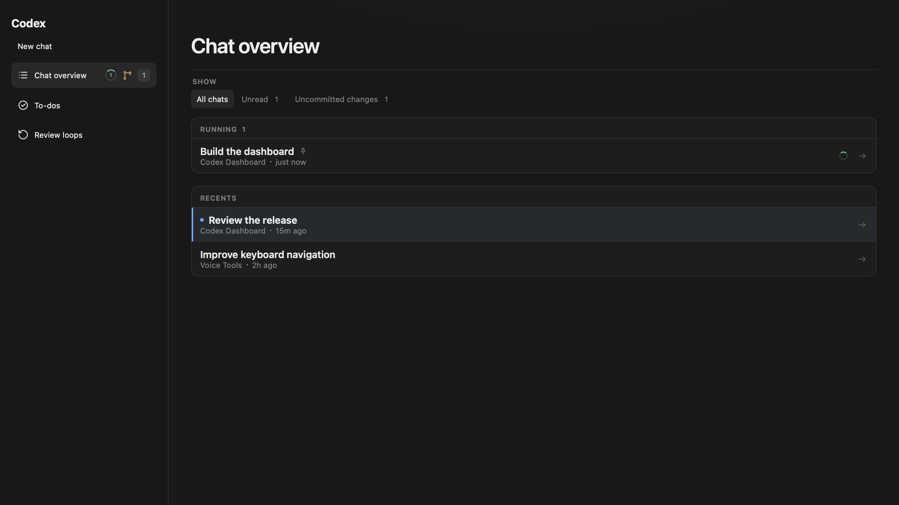

# Codex Dashboard

[](https://github.com/MrLawrenceAwe/Codex-Dashboard/actions/workflows/ci.yml)

A native macOS menu-bar utility that brings chat activity, unfinished work and project changes into one dashboard inside Codex.

**Stack:** Swift 6, AppKit, JavaScript, XCTest and WebKit.

This is an independent personal project and is not affiliated with OpenAI.



*Screenshot from the automated visual test fixture; all chats and projects are synthetic.*

## Engineering highlights

- Coordinates native filesystem monitoring with a modular web interface.
- Saves prompts, to-dos and review-loop progress with recovery after failed writes.
- Includes state, persistence, cancellation and visual regression tests.

## Project overview

- **Chat monitoring:** recent activity, unread status, completion tracking, uncommitted files and unpushed Git commits.
- **Review loops:** concurrent project reviews with automatic fixes and commits, separate model choices, pause/resume/stop controls, and optional remote pushing. See [review-loop behaviour](docs/usage.md#review-loops).
- **Workflow tools:** a reusable prompt library and a persistent to-do list with tags, projects and images.
- **Implementation:** Swift 6, AppKit and JavaScript, with a native coordinator and a modular renderer interface.
- **Automated testing:** XCTest and WebKit tests cover state changes, persistence, migration failures, UI behaviour and screenshot-based visual regression.

Chat overview groups chats using Codex’s current saved projects, combining symlink aliases. Chats from removed projects remain under **Other chats**, without project change indicators.

Chat overview’s **Local changes** filter includes uncommitted files and unpushed commits, with separate status labels. Unpushed status uses local remote-tracking refs without fetching; a branch without an upstream is compared with all known remote refs. Repositories without a remote show only uncommitted changes.

The project explores reliable desktop workflow automation, including file-change
monitoring, scheduled refresh, asynchronous persistence and recovery after failed
writes. Test fixtures use synthetic data.

The DevTools connection is limited to the local machine. New Codex launches use a new
high port; Dashboard reuses that port when reconnecting to the running Codex process.
Chromium DevTools does not authenticate local clients.
Use this utility only on a trusted personal macOS account; do not leave Codex running
with the dashboard enabled when untrusted local software has access to your account.

## Install

Requires macOS 14+, the Codex desktop app, and a Swift 6 toolchain. CI uses macOS 26 and Xcode 26.6 for WebKit visual baselines.

Run:

```sh
./install.sh
```

This runs the test suite, builds and signs `Codex Dashboard.app`, then
atomically installs it in `$HOME/Applications`, preserving the previous bundle until the replacement is verified. Use `./install.sh --relaunch` to open the
new build, or `--skip-tests` during local iteration. `--no-launch` is the
default and is also accepted explicitly.

Local installs create and reuse a **Codex Dashboard Local Development** signing
certificate in your login Keychain. Saved-account credentials are accessed by a
separately signed helper whose approvals persist across Dashboard-only rebuilds.
Choose **Always Allow** when macOS first asks the helper to access a saved account;
each account is a separate Keychain item. Changes to the helper or signing
certificate may require approval again.

To use an existing signing certificate, set `SIGNING_IDENTITY` to its name or SHA-1
fingerprint when running the installer. The installer stops if signing fails.
See [local signing](docs/development.md#local-signing) for certificate trust,
Keychain partition identities, and approval persistence details.

To uninstall without permanently deleting the bundle, run `./uninstall.sh`.
It moves the installed app to the Trash.

## Use

1. Open **Codex Dashboard** from `$HOME/Applications`; it appears in the menu bar.
2. Finish any active response in Codex.
3. Select **Restart & Enable**.
4. Select **Chat overview** directly in the Codex sidebar. It opens in
   the main content pane while the rest of Codex navigation stays available.

Keep Dashboard running to refresh activity and restore its controls after Codex
reloads. Use the menu bar for Diagnostics, Launch at Login, automatic completion
focus, and **Disable dashboard integration**.

See [Using Codex Dashboard](docs/usage.md) for chat filters, prompts, to-dos,
accounts, usage alerts, review loops, and recovery instructions.

## Development

See [architecture and behaviour](docs/architecture.md) for runtime, storage, refresh,
and notification details. See [development and testing](docs/development.md) for
renderer previews, resource organisation, migrations, and visual baselines.

With **Reload browser extension** enabled, Review Loop instructs Codex to use the globally configured `chrome-devtools` MCP server to reload Chrome extensions before live testing and after building fixes. Codex verifies the reload and refreshes affected test pages. If the tools are unavailable or reload fails, it returns `# Extension reload required` with a `## Summary` containing the browser, extension, steps, and reason. The loop displays those instructions as **Waiting for extension reload**. After reloading, select **Extension reloaded — continue** to resume the same chat and round, preserving unfinished fixes. Final review and commit checks still run before the round can complete.
